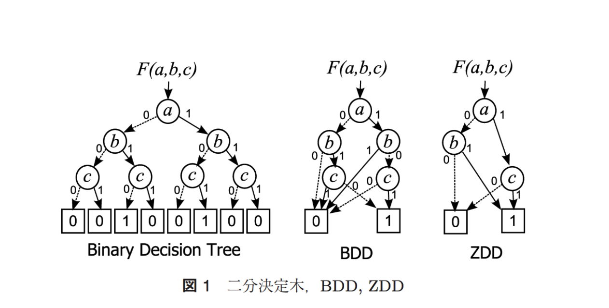

# BDD / ZDD

二分決定グラフ (Binary Decision Diagram; BDD) は，木構造によって論理関数を表すデータ構造である．
変数が $n$ 個あれば，深さが $n$ の二分木で必ず表現することができるが，これを加法標準形のような形に圧縮するのが BDD．
ZDD は更に加法標準形の負リテラルを削ぎ落としたバージョン．

圧縮方法

## 参考

* https://qiita.com/tsukasa_diary/items/d2b5940dacf3c3a8d3ff
* [BDD/ZDDを用いたグラフ列挙索引化技法](https://ci.nii.ac.jp/naid/110009625944)
