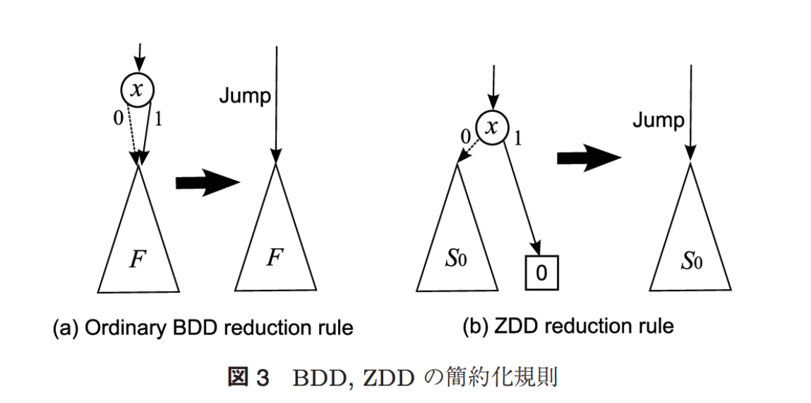

# BDD / ZDD

二分決定グラフ (Binary Decision Diagram; BDD) は，木構造によって論理関数を表すデータ構造である．

論理関数は，変数が $n$ 個あれば，深さが $n$ の二分木で必ず表現することができるが，これを加法標準形のような形に圧縮するのが BDD．
ZDD (Zero-suppressed BDD) は，関数を組み合わせ集合と見た場合，すなわち加法標準形の負リテラルを削ぎ落としたバージョンの BDD．

**圧縮方法**
* {0, 1} のどちらの行き先も同じノード（同じ変数ではない）を持つノードは削除することができる
* 任意の枝 b in {0, 1} に対して，b の行き先が同じノードを持つ 2 つのノードは1つにまとめることができる．

**ZDD固有の圧縮方法**
* 1-枝が `0` (0を意味する葉) を指すノードを削除する．そのノードに入力されている矢印を，ノードの0-枝の先に接続する．

## 参考

* https://qiita.com/tsukasa_diary/items/d2b5940dacf3c3a8d3ff
* [BDD/ZDDを用いたグラフ列挙索引化技法](https://ci.nii.ac.jp/naid/110009625944)
